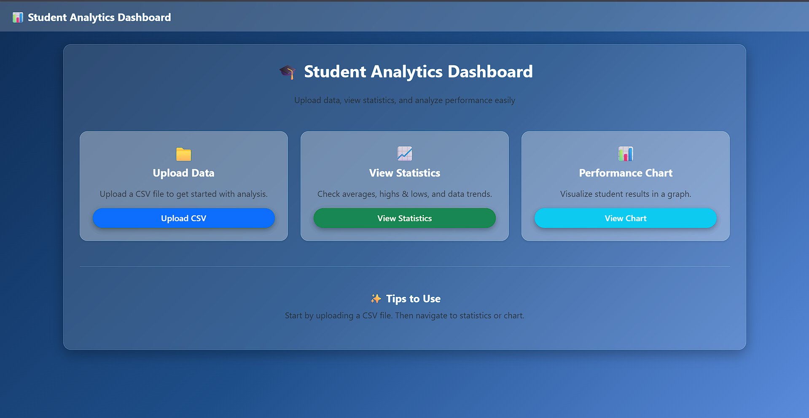
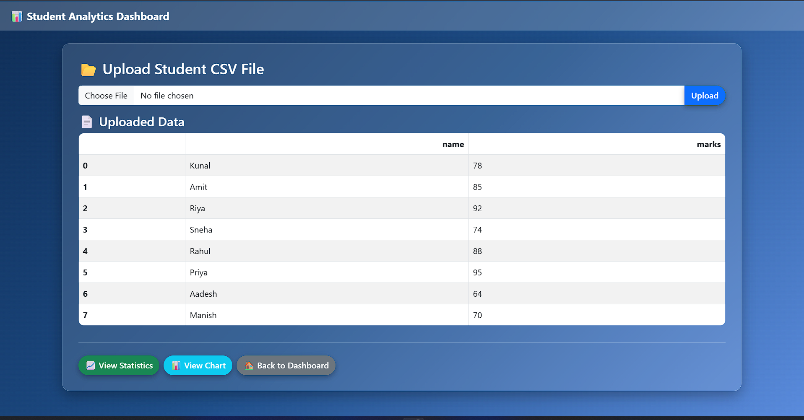
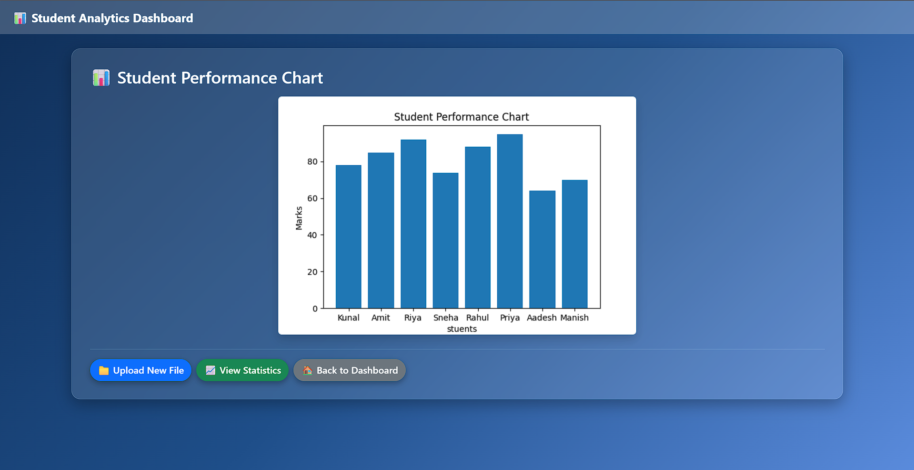

---
## 📊 Student Performance Analytics Dashboard (Django)

A web-based analytics tool built with **Django, Pandas, NumPy, and Matplotlib** to analyze student performance from CSV files.

This project lets users:

✔ Upload student data (CSV)

✔ View statistical insights (Average, Highest, Lowest, Std Dev)

✔ Visualize results using charts

✔ Navigate smoothly with a modern Bootstrap UI

---

## 🏠 Dashboard


## 📂 Upload Page



## 📊 Chart Page


---

## 🚀 Features

| Feature                | Description                                                  |
| ---------------------- | ------------------------------------------------------------ |
| 📂 File Upload         | Upload CSV files containing student data.                    |
| 📈 Statistics          | Calculates mean, max, min, & standard deviation using NumPy. |
| 📊 Chart Visualization | Graph generated using Matplotlib and shown on webpage.       |
| 🎨 Modern UI           | Gradient + Glass effect UI with Bootstrap.                   |
| 🔁 Easy Navigation     | Buttons to move between pages smoothly.                      |

---

## 🧠 Tech Stack

**Frontend:** HTML, CSS, Bootstrap
**Backend:** Django
**Data Processing:** Pandas, NumPy
**Visualization:** Matplotlib
**Storage:** CSV (no database needed, but can be added)

---

## 📁 Project Structure

```
student_dashboard/
│
├── analytics/
│   ├── templates/analytics/
│   │   ├── base.html
│   │   ├── dashboard.html
│   │   ├── upload.html
│   │   ├── statistics.html
│   │   ├── chart.html
│   ├── views.py
│   ├── urls.py
│
├── student_dashboard/
│   ├── settings.py
│   ├── urls.py
│
├── uploads/ (for uploaded files)
├── manage.py
└── requirements.txt
```

---

## ⚙️ Installation & Setup

### 1️⃣ Clone the repository

```bash
git clone https://github.com/your-username/student-dashboard.git
cd student-dashboard
```

### 2️⃣ Install dependencies

```bash
pip install -r requirements.txt
```

### 3️⃣ Run the server

```bash
python manage.py runserver
```

### 4️⃣ Open in browser

```
http://127.0.0.1:8000/
```

---

## 📥 Sample CSV Format

```
name,marks
Kunal,78
Amit,85
Riya,92
Sneha,74
Rahul,88
Priya,95
```

---

## 📌 Pages Overview

| Page       | Route      | Action                    |
| ---------- | ---------- | ------------------------- |
| Dashboard  | `/`        | Navigation & overview     |
| Upload CSV | `/upload/` | Upload student dataset    |
| Statistics | `/stats/`  | Show statistical analysis |
| Chart      | `/chart/`  | Display performance graph |

---
